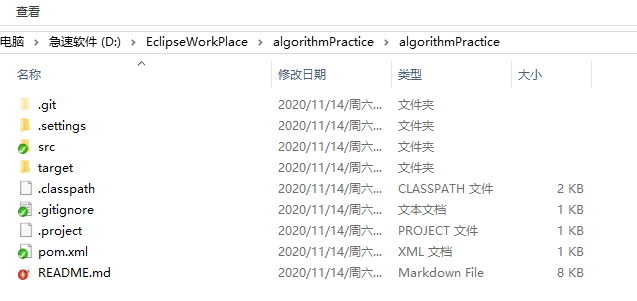
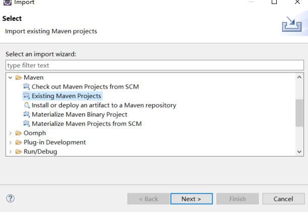
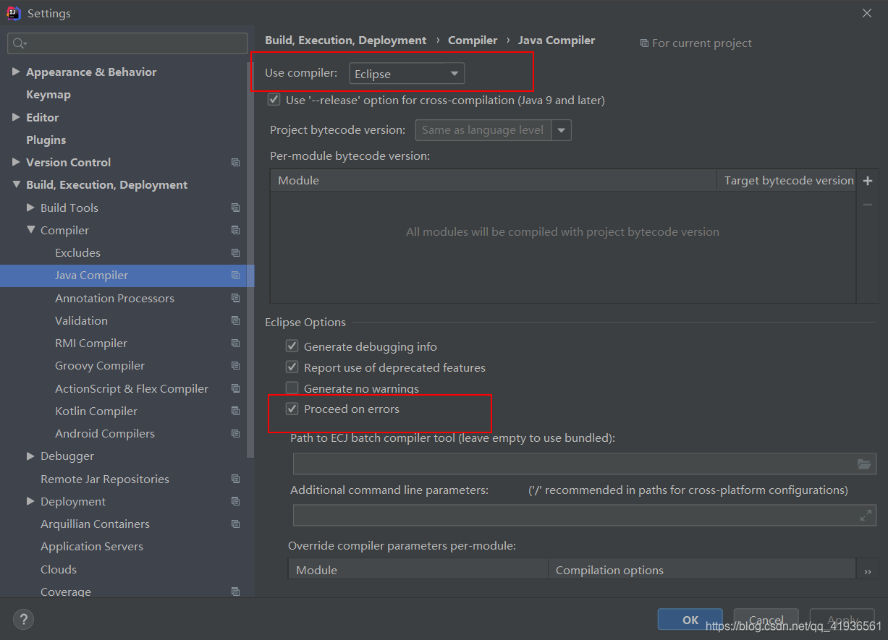

# KnowledgePractice

| 📊 |⚔️ | 🖥 | 🚏 | 🏖  | 🌁| 📮 | 🔍 | 🚀 | 🌈 |💡
| :--------: | :---------: | :---------: | :---------: | :---------: | :---------:| :---------: | :-------: | :-------:| :------:|:------:|
| [Java源码解析](#解析源码) | [数据结构](#数据结构) | [经典算法](#经典算法)  | [经典问题](#经典问题) | [功能函数](#常用功能函数) |[LeetCode题解](#LeetCode题解)|[待更](#待更)|[待更](#待更)|[待更](#待更)| [待更](#待更)|[联系作者](#联系作者) |

# 一：Java深入理解与源码分析

## 1:基本的程序设计结构 :traffic_light:
### 数据类型

>> [为什么Java要把字符串设计成不可变的](http://www.hollischuang.com/archives/1246) 

>> [基本数据类型与引用数据类型的传递方式](http://cheerui.cn/2018/11/11/java%E7%9C%9F%E7%9A%84%E5%8F%AA%E6%9C%89%E5%80%BC%E4%BC%A0%E9%80%92/) 

>> [Java中的四种引用类型](https://juejin.im/post/5a5129f5f265da3e317dfc08) 

### 关键字

>> [彻底搞懂volatile关键字](https://iamshuaidi.github.io/2018/08/20/java/%E7%BA%BF%E7%A8%8B%E5%AE%89%E5%85%A8(%E4%B8%8A)--%E5%BD%BB%E5%BA%95%E6%90%9E%E6%87%82volatile%E5%85%B3%E9%94%AE%E5%AD%97/) 
>> [synchronized关键字](https://mp.weixin.qq.com/s/8j9iEqLzRx4q-SBJSwVn5g) 

## 2:对象与类
>> [Java对象的创建过程：类的初始化与实例化](https://blog.csdn.net/justloveyou_/article/details/72466416) 

## 3:Java面向对象的特性
>> [重写与重载](http://www.hollischuang.com/archives/1308) 
 
 
 
 

## 4:Java中常用的对象与方法
>> [一次性搞清楚equals和hashCode](https://www.cnblogs.com/lulipro/p/5628750.html) 

## 5:异常，日志，断言和调试
>> [Java中try，catch，finally的细节分析](http://www.cnblogs.com/aigongsi/archive/2012/04/19/2457735.html) 

## 7:集合
>> [ArrayList工作原理及实现](https://mp.weixin.qq.com/s/TU0svu-FHzvleQB4i0OELA) 
>> [Java7/8 中的HashMap 和 ConcurrentHashMap](https://www.jianshu.com/p/39a57484932e) 

## 9:反射
>> [反射机制](https://www.jianshu.com/p/f1d1673f2336) 

## 10:IO流
>> [NIO浅析](https://tech.meituan.com/nio.html) 

# 二：数据结构

## 数组
 

## 链表
 

## 栈

 

## 队列

## 矩阵相关 :construction:
>> [正反矩阵打印与之字打印](https://www.cnblogs.com/nullering/p/9558839.html)

## 二叉树相关 :ocean:
>> [二叉树认知](https://www.cnblogs.com/nullering/p/9564802.html)

>> [2-3树]() 
>> [BST树]() 
>> [AVL树]() 
>> [RBT红黑树]() 
>> [哈夫曼树]() 

>> [形象打印二叉树](https://github.com/3218870799/algorithmPractice/blob/master/src/com/xqc/binartTree/IsBSTAndCBT.java) 
>> [判断是否是平衡二叉树]() 

## 窗口相关 :ferris_wheel:
 
 
 
 

# 三：经典算法 

https://www.cnblogs.com/nullering/p/9536339.html欢迎各位指导！

## 基础算法:four_leaf_clover:
>> 枚举 
>> 递推 
>> 贪心 
>> 递归 
>> 分治 
>> 构造 
>> 模拟 
>> 排序 
>> 检索 

## 排序  :heart: 
>> ### 比较排序
>> [基础认知：Java集合](https://www.cnblogs.com/nullering/p/9600821.html) 
>> [冒泡排序](https://www.cnblogs.com/nullering/p/9537321.html) 
>> [选择排序](https://www.cnblogs.com/nullering/p/9537321.html) 
>> [直接插入排序](https://www.cnblogs.com/nullering/p/9537321.html) 
>> [快速排序](https://www.cnblogs.com/nullering/p/9537321.html) 
>> [归并排序](https://www.cnblogs.com/nullering/p/9537321.html) 
>> [堆排序](https://www.cnblogs.com/nullering/p/9537321.html) 
>> ### 非比较排序
>> [计数排序](https://www.cnblogs.com/nullering/p/9556567.html) 
>> [基数排序](https://www.cnblogs.com/nullering/p/9556567.html) 
>> [桶排序]() 

## 典型基础 :mountain_cableway:
>> [KMP算法](https://www.cnblogs.com/nullering/p/9536339.html) 
>> [布隆过滤器](https://www.cnblogs.com/nullering/p/9536339.html) 
>> [一致性哈希](https://www.cnblogs.com/nullering/p/9536339.html) 

## 图论相关算法
>> [广度优先搜索BFS](https://github.com/3218870799/algorithmPractice/blob/master/src/com/xqc/classic/BFS.java) 
>> [Warshall算法]() 
>> [Floyed算法]() 
>> [Prim算法]() 
>> [Kruskal算法]() 
>> [Dijkstra算法]() 
>> [并查集]() 

## 数论计算
>> [求最大公约数与最小公倍数](https://github.com/3218870799/algorithmPractice/blob/master/src/com/xqc/function/Calauate.java) 
>> [组合](https://github.com/3218870799/algorithmPractice/blob/master/src/com/xqc/function/Combination.java) 
>> [大数加法减法乘法]() 
>> [矩阵]() 
>> [线性筛]() 
## 字符串
>> [最长公共子序列    最长上升子序列   ]()

# 四：经典问题
>> [旅行商问题]() 
>> [凸包问题]() 
>> [曼哈顿问题]() 
>> [n皇后问题]() 

# 五：常用功能类与功能函数
>> [微信支付工具类]() 
>> [字符排列数工具类]() 
>> [字符编码工具类]() 
>> [数据类型转换工具类]() 

>> [常见加密算法工具类]() 
>>>> Base64加密Demo 
>>>> MD5加密Demo 

>> [字符串处理工具类]() 
 
 
 
 
 
 

# 六：LeetCode题解 :aerial_tramway:

 
 
 
 
>> 该部分答案多为本人刷题的题解,部分问题没有官方解答，所以贡献一份思路，并将最优解答Copy至此,便于向高手学习

>> 题目描述请移步[LeetCode](https://leetcode-cn.com/) 

| 数组 | 链表 | 字符串 | 哈希表 | 队列 |
|:-------:|:-------:|:-------:|:-------:|:-------:|
|15:三数之和| 19：删除链表的倒数的第N个节点 | 6:Z字形变换 | 待更 | 622:设计循环队列 |
|16:最接近的三数之和| 21:合并两个有序链表 | 12:整数转罗马数字 | 待更 | 待更 |
|26: 删除排序数组中的重复项| 24：两两交换链表中的节点 | 13:罗马转整数 | 待更 | 待更 |
|27: 移除元素| 141：判断链表是否有环 | 14:最长公共前缀 | 待更 | 待更 |
|33: 在旋转排序数组中搜索| 142：返回虚幻链表中的进环节点 | 17：电话号码的字母组合 | 待更 | 待更 |
|105: 从前序与中序序列构件二叉树| 206：反转链表 | 20：有效的括号 | 待更 | 待更 |
| 待更 | 待更 | 125：验证回文串 | 待更 | 待更 |

|栈 | 递归 | 树 | 堆 | 图 |
|:-------:|:-------:|:-------:|:-------:|:-------:|
|225: 用队列实现栈结构| 687：最长同值路径 | 待更 | 待更 | 待更 |
|232: 用栈实现队列| 待更 | 待更 | 待更 | 待更 |

| 排序 | 拓扑排序 | 深度优先搜索 | 二分查找 | 双指针 | 广度优先搜索 |
|:-------:|:-------:|:-------:|:-------:|:-------:|:-------:|
| 待更 | 待更 | 待更 | 待更 | 待更 | 待更 |

| 贪心算法 | 回溯算法 | 分治算法 | 动态规划 |
|:-------:|:-------:|:-------:|:-------:|
| 待更 | 待更 | 待更 | 待更 |

# 七：项目说明:hammer:

本项目一开始使用简单的java项目创建，后随着内容逐渐丰富，先变成Maven项目进行管理。

使用不同开发工具对本项目进行开发，方法不唯一，只是提供一个参考

## 1：使用Eclipse

1：使用Git克隆到本地

2：工作区导入已存在的Maven项目

3：选择克隆的项目即可

# 2：IDEA

1：使用Git克隆到本地

2：直接选择Open or import 导入IDEA

3：解决单个类方法错误影响其他类的运行/错误: 找不到或无法加载主类

选择setting，将编译器改成Eclipse

找到Run ——Edit Configuration

将Build点减号删掉选择Build No erroe check

# 联系作者 :hibiscus:

 
 
 
 
 
 
 

# 待更 :four_leaf_clover:

