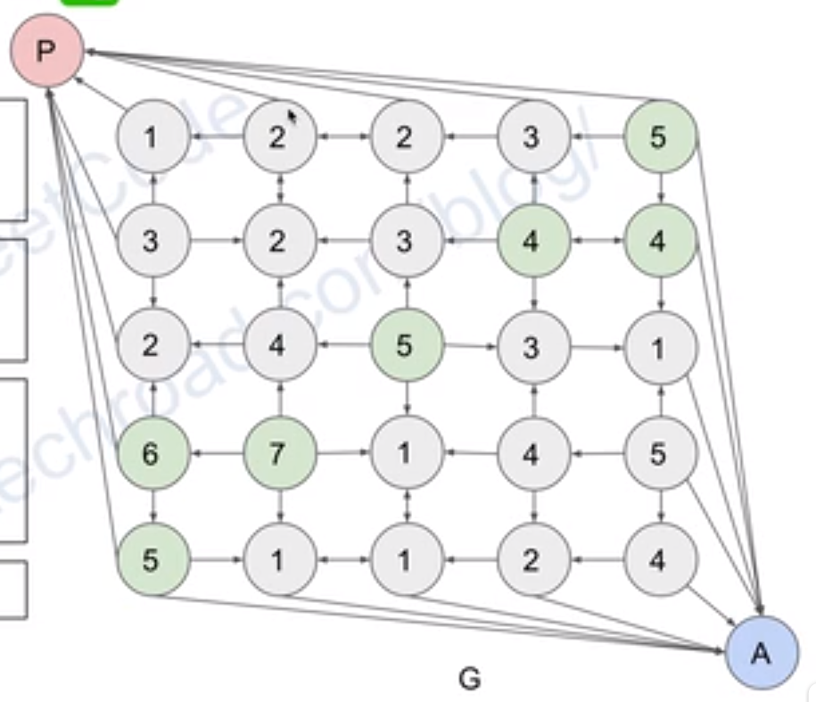

# 417太平洋大西洋水流问题

## 题目

给定一个 m x n 的非负整数矩阵来表示一片大陆上各个单元格的高度。“太平洋”处于大陆的左边界和上边界，而“大西洋”处于大陆的右边界和下边界。

规定水流只能按照上、下、左、右四个方向流动，且只能从高到低或者在同等高度上流动。

请找出那些水流既可以流动到“太平洋”，又能流动到“大西洋”的陆地单元的坐标。

 

提示：

输出坐标的顺序不重要
m 和 n 都小于150

示例：

 

给定下面的 5x5 矩阵:

  太平洋 ~   ~   ~   ~   ~ 
       ~  1   2   2   3  (5) *
       ~  3   2   3  (4) (4) *
       ~  2   4  (5)  3   1  *
       ~ (6) (7)  1   4   5  *
       ~ (5)  1   1   2   4  *
          *   *   *   *   * 大西洋

返回:

[[0, 4], [1, 3], [1, 4], [2, 2], [3, 0], [3, 1], [4, 0]] (上图中带括号的单元).

## 思路

 认为边界上的可以是无穷小，

Grap图

如果大于等于它的邻居就有一条边，最右和最上都可以连到P，最左和最下都可以连到A，枚举每个节点，通过dfs，是否存在某条路径既能到P又能到A，

由于需要回溯，会超时

优化：

因为第一步有很多重复

将所有路径都反向，从p出发。从A点出发，将能够到达的顶点集合保存下来，只需要记录是否访问过，不需要回溯，等价于从边界出发，

dfs与Bfs

dp做法

问neigber能不能到某个点，

